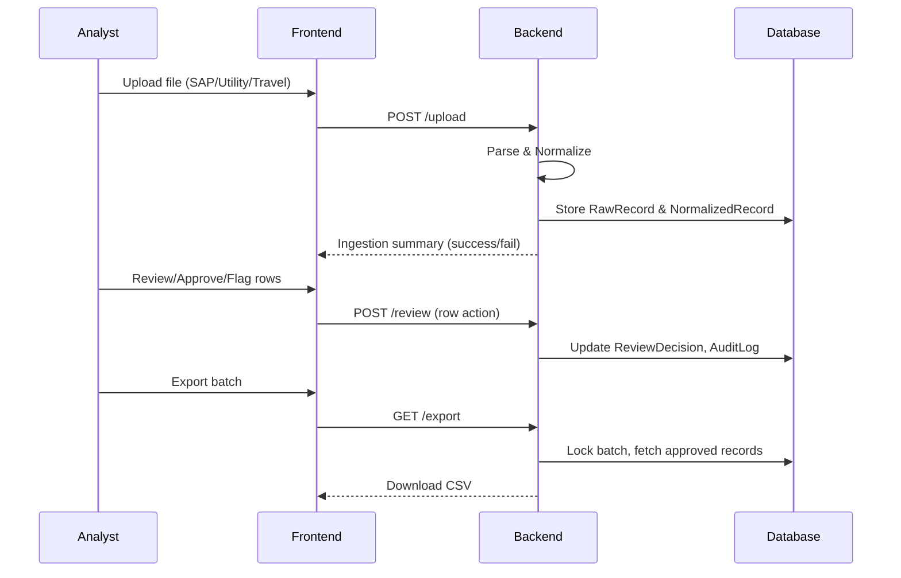

# Breathe ESG — Emissions Data Ingestion & Review Platform

## Overview
Breathe ESG is a Django REST + React application for ingesting, normalizing, and reviewing enterprise emissions and activity data. The platform is designed to handle real-world data from SAP (fuel/procurement), utility portals (electricity), and corporate travel (Concur/Navan), providing a unified review dashboard for analysts and an immutable audit trail for compliance.

---

## Features
- **Multi-source Ingestion:** Upload and parse SAP flat files, utility CSVs, and travel data (Concur-style CSV).
- **Normalization:** Automatic unit conversion to SI, column mapping, proration for billing periods, and distance calculation for travel.
- **Review Workflow:** Analysts can review, approve, flag, or reject each row. All actions are logged immutably.
- **Audit Export:** Export only after all rows are reviewed. Export is locked and auditor-ready.
- **Multi-tenancy:** All data is scoped to a client. Supports multiple clients with strict data isolation.
- **Error Handling:** Failed parses are surfaced in the UI and stored for audit.
- **Documentation:** All design decisions, tradeoffs, and data model rationale are documented in the `md/` folder.

---

## Data Sources & Sample Data
- **SAP (Fuel/Procurement):** `sample_data/sap_fuel_sample.csv` — Realistic flat file with mixed units, plant codes, and errors.
- **Utility (Electricity):** `sample_data/utility_electricity_sample.csv` — Portal-style CSV with billing periods, kWh usage, and tariffs.
- **Travel (Concur/Navan):** `sample_data/travel_concur_sample.csv` — CSV with flight, hotel, car, and rail segments, using IATA codes and realistic fields.

---


## Architecture Diagram
```mermaid
flowchart TD
  A[File Upload (SAP/Utility/Travel)] -->|API| B(Django Backend)
  B --> C[Parser & Normalizer]
  C --> D[RawRecord (Immutable)]
  C --> E[NormalizedRecord (SI, Scope, Category)]
  E --> F[Review Workflow]
  F --> G[ReviewDecision & AuditLog]
  F --> H[Frontend Dashboard]
  H -->|Actions| F
  F --> I[Audit Export (CSV)]
  subgraph Data Storage
    D
    E
    G
  end
```

## Project Structure
```
breatheesg_backend/       # Django project settings
emissions/                # Core app: models, views, parsers
frontend/                 # React frontend (dashboard, API integration)
sample_data/              # Realistic sample data for all sources
md/                       # Documentation: model, decisions, tradeoffs, sources
```

---


## Workflow Diagram


---

## Key Models
- **Client:** Multi-tenant root. All data is scoped to a client.
- **IngestionBatch:** Tracks each upload event, source type, and status.
- **RawRecord:** Immutable copy of each parsed row (original data).
- **NormalizedRecord:** Unified, normalized row ready for review (SI units, scope, category, etc.).
- **ReviewDecision:** Analyst sign-off (approved, flagged, rejected) with notes.
- **AuditLog:** Immutable log of all edits and reviews.
- **UnitLookup:** Registry for unit conversions.

---

## Technology Stack
- **Backend:** Django 5, Django REST Framework, PostgreSQL
- **Frontend:** React 19 (Create React App / react-scripts)
- **Styling:** Plain CSS
- **Deployment:** (Add your deployment URL and provider here)

---

## Setup & Running Locally
1. **Clone the repository:**
   ```sh
   git clone <your-repo-url>
   cd breatheesg
   ```
2. **Backend:**
   - Create and activate a Python virtual environment.
   - Install dependencies:
     ```sh
     pip install -r requirements.txt
     ```
   - Run migrations:
     ```sh
     python breatheesg_backend/manage.py migrate
     ```
   - Seed unit conversions:
     ```sh
     python breatheesg_backend/manage.py seed_units
     ```
   - Start the backend server:
     ```sh
     python breatheesg_backend/manage.py runserver
     ```
3. **Frontend:**
  - Navigate to `frontend/`:
    ```sh
    cd frontend
    npm install
    npm start
    ```
  - The frontend will run on [http://localhost:3000](http://localhost:3000) and proxy API requests to the backend.

## Tests
1. **Backend tests:**
  ```sh
  python breatheesg_backend/manage.py test
  ```
2. **Frontend tests:**
  ```sh
  cd frontend
  npm test -- --watchAll=false
  ```

## Sample Data Loader
To load all files in `sample_data/` into the database:
```sh
python breatheesg_backend/manage.py load_sample_data --client "Sample Client"
```

## Environment Notes
- For production, set `DEBUG=False` and provide `DATABASE_URL` (Postgres) and `DJANGO_SECRET_KEY`.
- The frontend uses the CRA proxy (`/api`) by default; set `REACT_APP_API_BASE_URL` to point at a deployed API if needed.

---

## Documentation
- **MODEL.md:** Data model and rationale (multi-tenancy, normalization, audit trail, etc.)
- **DECISIONS.md:** All design choices, ambiguities resolved, and open questions.
- **TRADEOFFS.md:** What was deliberately not built and why.
- **SOURCES.md:** Research and rationale for each data source and sample data.

---

## Defending Your Work
- All sample data is realistic and justified in `SOURCES.md`.
- All major design decisions are explained in `DECISIONS.md`.
- Tradeoffs and scope cuts are documented in `TRADEOFFS.md`.
- The data model is designed for auditability, multi-tenancy, and real-world complexity.

---

## Submission
- **Deployed App:** (Add your live URL here)
- **GitHub Repo:** (Add your repo link here)
- **Credentials:** (Add demo credentials if required)

---

## Contact
For questions or access, contact the maintainers or the emails listed in the assignment.

---

## License
MIT License (or your chosen license)
